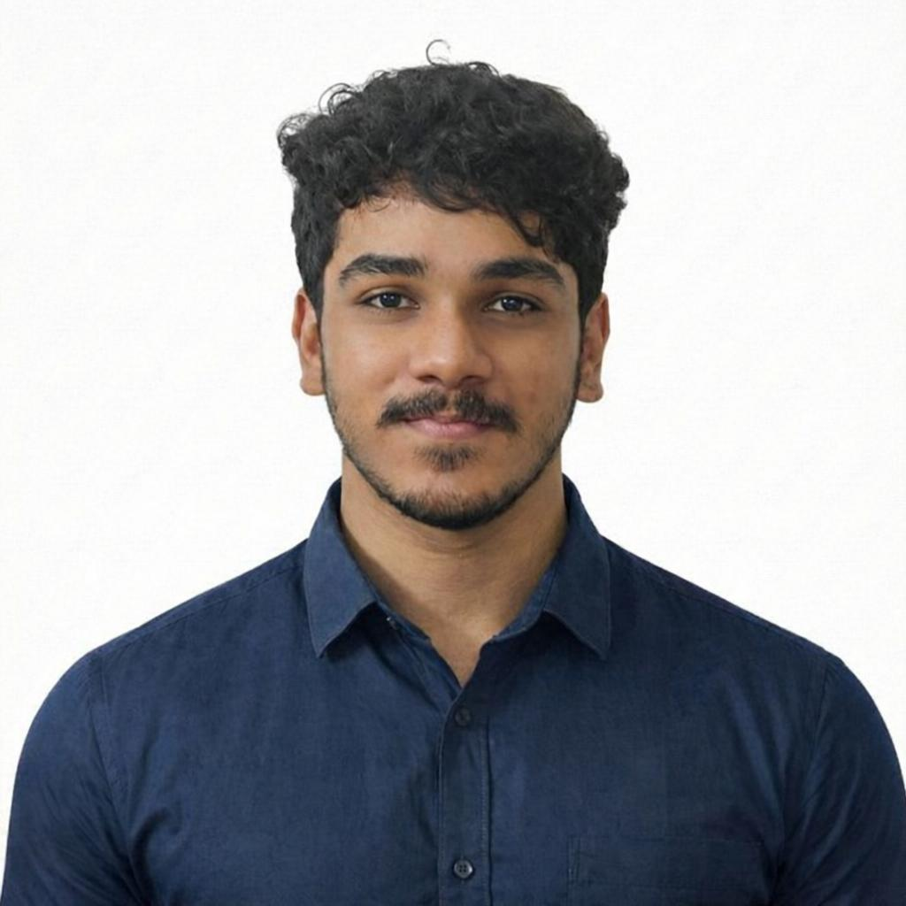

# Hi, I'm Abhayadev RVM! 👋

Pursuing BTech in Computer Science and Engineering at VIT Vellore

---

## 🚀 About Me

Passionate about logic, precision, and problem solving. I am a detail oriented generalist who utilizes AI to build efficient, high-quality solutions. I believe that if a job is worth doing, it is worth doing to perfection.

## 🛠 Skills
* **Core:** AI Generalist, Prompt Engineering, Workflow Optimization
* **Quality Assurance:** Editing, verifying and refining AI generated content for accuracy and tone.
* **Tools:** Generative AI, Github/Version Control
* **Languages:** Malayalam (Native), English, Hindi

## 💼 Experience

### AI Engineer | NeuMe Neurotech
**Participated in the Smart India Hackathon 2025, building an interface which can predict the probabilty of getting an internship based on skills and company requirements.**

## 📚 Education
**BTech in Computer Science and Engineering**
* VIT Vellore, 2029*

## 📫 Contact Me
* **Email:** [abhayadevrvm@gmail.com]
* **LinkedIn:** [www.linkedin.com/in/abhayadev-rvm-799221282]
